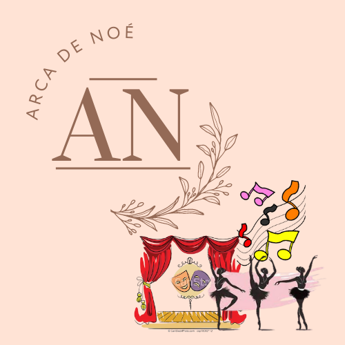

<p align="center">
  
</p>
<br>

<b><h1>Arca de Noé</h1></b>

## TEMA:

Cursos gratuitos a todes!<br><br>

## JUSTIFICATIVA:

<p align="justify">Quando iniciei minha carreira artística, várias pessoas com bastante conhecimento na área, forneciam diversos tipos de cursos gratuitos para que nós jovens adolescentes, se profissionalize. Como forma de  agradecimento, criei a Arca de Noé para que a semente que foi plantada em mim aos  17 anos, germine em mais alguns por esse mundão de meu Deus</p><br>


## ⚙️FUNCIONALIDADES:

➤ Alunos<br>

✘ Cadastramento de alunos;<br>
✘ Listar os cadastros de todos alunos da API;<br>
✘ Buscar o aluno por Id;<br>
✘ Atualizar o cadastro do aluno;<br>
✘ Deletar o cadastro do aluno;<br>

➤ Cursos<br>

✘ Cadastrar os cursos;<br>
✘ Listar os cadastros de todos os cursos da API;<br>
✘ Buscar o curso por Id;<br>
✘ Atualizar o cadastro do curso;<br>
✘ Deletar o cadastro do curso;<br>


## 💻MÉTODOS:
<p align="justify">API desenvolvida utilizando JavaScript e Node.js. Possui CRUD e utiliza a conexão com bando de dados MongoDB e as rotas foram testes no Insominia.</p><br>


## 📂 ARQUITETURA MVC
```
📁ARCA-DE-NOE
|
|- 📁 assets
|- 📁 src
| |
| |- 📁 controller
| |- 📑 alunosController.js
| |- 📑 cursosController.js
|
| |- 📁 config
| |- 📑 database.js
|
| |- 📁 models
| |- 📑AlunosSchema.js
| |- 📑CursosSchema.js
|
| |- 📁 router
| |- 📑alunosRoutes.js
| |- 📑cursosRoutes.js
| |- 📑indexRouter.js
|
| |- 📑 app.js
|
|- 📑 .env
|- 📑 .gitignore
|- 📑 package-lock.json
|- 📑 package.json
|- 📑 README.md
|- 📑 server.js
|- 📑 vercel.json
```
<br>

## TECNOLOGIAS E PACOTES UTILIZADOS:


**TECNOLOGIAS**

- [Git/GitHub](https://github.com/)
- [Vercel](https://vercel.com/)
- [JavaScript](https://www.javascript.com/)
- [MongoDB Atlas](https://www.mongodb.com/cloud/atlas)
- [Node.js](https://nodejs.org/en/)
- [Insominia](https://insomnia.rest/)
- [VScode](https://code.visualstudio.com/)  
- [Canva](https://www.canva.com/)

### PACOTES


- [Cors](https://www.npmjs.com/package/cors)
- [Dotenv-safe](https://www.npmjs.com/package/dotenv)
- [Express](https://expressjs.com/pt-br/)
- [Mongoose](https://mongoosejs.com/)
- [Nodemon](https://www.npmjs.com/package/nodemon)

<br>

# ROTAS
➤ Alunos<br>
| <p align="center">Método HTTP </p>  |<p align="center"> Endpoint    </p>    | <p align="center">Descrição  </p>    |
| ------------------------ | ---------------------------- | ------------------------------------------ |
| <p align="center">GET </p>         | <p align="center">`/alunos/all`   </p>      | <p align="center">Listar os alunos cadastrados  </p>          |
| <p align="center">GET  </p>        |<p align="center"> `/alunos/buscar/:id`</p>         | <p align="center">Buscar o aluno através do ID         |  |
| <p align="center">POST  </p>        |<p align="center"> `/alunos/criar` </p>    | <p align="center">Criar o cadastro do aluno</p> |    
| <p align="center">PATCH  </p>     |<p align="center"> `/alunos/atualizar/:id` </p>        | <p align="center">Atualizar o cadastro do aluno através do ID</p>
| <p align="center">DELETE  </p>     |<p align="center"> `/alunos/deletar/:id` </p>        | <p align="center">Deletar o cadastro do aluno através do ID </p>
<br>

➤ Alunos<br>
| <p align="center">Método HTTP </p>  |<p align="center"> Endpoint    </p>    | <p align="center">Descrição  </p>    |
| ------------------------ | ---------------------------- | ------------------------------------------ |
| <p align="center">GET </p>         | <p align="center">`/cursos/all`   </p>      | <p align="center">Listar os cursos cadastrados  </p>          |
| <p align="center">GET  </p>        |<p align="center"> `/cursos/buscar/:id`</p>         | <p align="center">Buscar o curso através do ID         |  |
| <p align="center">POST  </p>        |<p align="center"> `/cursos/criar` </p>    | <p align="center">Criar o cadastro do curso</p> |    
| <p align="center">PATCH  </p>     |<p align="center"> `/cursos/atualizar/:id` </p>        | <p align="center">Atualizar o cadastro do curso através do ID</p>
| <p align="center">DELETE  </p>     |<p align="center"> `/cursos/deletar/:id` </p>        | <p align="center">Deletar o cadastro do curso através do ID </p>
<br>


## 🛑​ PARA REALIZAR A INSTALAÇÃO NO SEU COMPUTADOR:


1. Primeiro é necessário clonar o seguinte repositório:

    ```bash
    $ git clone https://github.com/MBTGrazielle/Mercado-Solidario
     ```

2. Entre na seguinte pasta: 

    ```bash
    $ cd Mercado-Solidario/
    ```
    
3. Para prosseguir, é necessário baixas as dependências: 

   ```bash
    $ npm install
    ```
4. Inicie o projeto com o comando: 

   ```bash
    $ npm run dev
    ```   

<br>

---

## CONHEÇA UM POUCO SOBRE MIM:

|||
|:------:|----|
|  | <p align="justify">Olá, sou Angela Valentin uma atriz brasileira em busca de um plano B. Como vcs sabem artistas brasileiros anônimos não conseguem viver da arte, apenas sobreviver. Foi pensando assim que vim de encontro com a REPROGRAMA, confesso que um ciclo bastante desafiador e repleto de obstáculos, mas como sempre, Deus não desampara nunca e colocou seus anjos para me apoiar e me dar força nessa jornada! Iniciei minha carreira artística num grupo de teatro amador participando de vários festivais pelo Brasil ganhando com minha atuação vários prêmios como melhor atriz e atriz coadjuvante. Por ter iniciado desta forma, numa comunidade periférica da zona sul de São Paulo que a idéia do meu projeto Arca de Noé é fornecer de forma gratuita essa “rede de ensino artístico” para as pessoas em condições vulneráveis.
</p> </h5> |

## CONTATO:
<br>
<div>
<a href="https://wa.me/5511984870429?text=Olá%2Ângela,%20vim%20do%20seu%20Projeto%20Final" target="_blank"></a>
<a href="https://www.linkedin.com/in/angelavalentin/" target="_blank"></a>   
<a href="https://github.com/AngelaValentin" target="_blank"></a>   
</div>